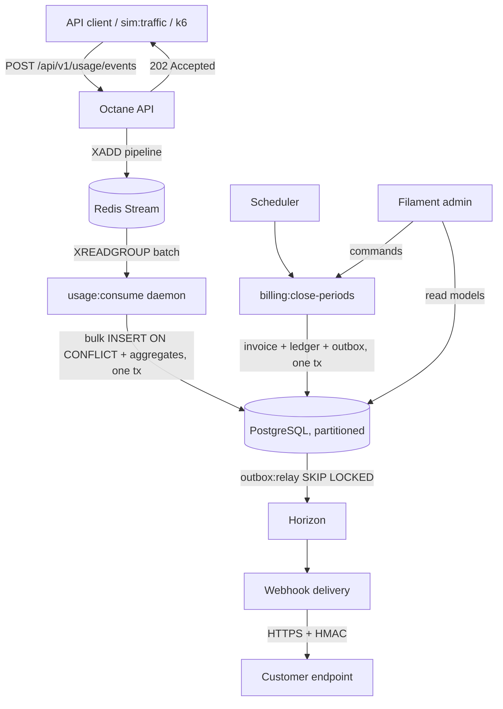

# Metered — usage-based billing platform

[](https://github.com/yarosavromachenko/Metered/actions/workflows/ci.yml)


> **Status: Phase A — documentation and rules.** No business code yet.
> The architecture, decisions, and quality gates below are committed; the
> implementation follows milestone by milestone (`docs/roadmap.md`).

Metered meters what customers consume, prices it, invoices it, books it into a
double-entry ledger, and notifies the customer's systems over signed webhooks —
the backend shape of Stripe Billing, Lago, or Orb.

It exists as a portfolio project with two jobs: **be readable** (a reviewer
understands the architecture in ten minutes) and **be runnable** (`make demo`
gives that reviewer a working admin panel with a system under live load).

---

## Quick start

```bash
git clone https://github.com/yarosavromachenko/Metered.git metered
cd metered
make demo
```

That builds the stack, migrates, seeds a demo dataset (~2M usage events over 90
days), and starts a traffic generator. Then open:

| What | Where |
|---|---|
| Admin panel | <http://localhost:8080/admin> — sign up, you get your own isolated demo tenant |
| API | <http://localhost:8080/api/v1> — key is printed by `sim:seed` |
| Horizon | <http://localhost:8080/horizon> |
| Grafana | <http://localhost:3000> — ingestion rate, stream lag, outbox lag, webhook success |

Nothing is hosted publicly: the whole system, including observability, runs from
this repository on your machine. `make help` lists every other entrypoint.

## What it does

- **Ingests** usage events at high rate: authenticate → validate shape → `XADD`
  to a Redis Stream → `202 Accepted`. The hot path never touches the database.
- **Aggregates** them exactly-once-in-effect: a consumer daemon batch-inserts
  into a partitioned table with `ON CONFLICT DO NOTHING RETURNING`, and updates
  pre-aggregates in the same transaction using only the rows that were actually
  inserted.
- **Prices** usage with four models — flat fee, per unit, graduated, volume —
  in a pure domain calculator with no framework and no `float`.
- **Closes billing periods** on the subscription's anchor date (with month-end
  clamping: 31 Jan → 28 Feb), issues invoices with gapless numbering, and books
  double-entry ledger transactions that can only be appended.
- **Delivers webhooks** with HMAC signatures, secret rotation, exponential
  backoff with jitter, a circuit breaker per endpoint, a dead-letter queue with
  replay, and an SSRF guard.
- **Explains itself**: one OpenTelemetry trace spans
  `HTTP → Redis Stream → consumer → PostgreSQL → outbox → queue → webhook`.

## Architecture

Modular monolith, four layers per module, dependency rules enforced in CI by
Deptrac and Pest Arch.



```
src/
├── Shared/       Clock, Money, UUIDv7, Outbox, Inbox, Idempotency, Audit, Tracing
├── Tenancy/      Organizations, projects, API keys, scopes, rate limiting
├── Usage/        Ingestion, stream consumer, partitions, aggregation, reconcile
├── Billing/      Meters, plans, prices, customers, subscriptions, pricing calculator
├── Invoicing/    Period close, invoices, ledger, credit notes, payments, PDF
├── Webhooks/     Endpoints, signing, delivery, retries, DLQ, circuit breaker
├── Admin/        Filament panel shell, cross-module dashboards
└── Simulation/   Dev-only: seeding, traffic, chaos, time travel
```

Full detail: [`docs/architecture.md`](docs/architecture.md). Every non-obvious
decision has an ADR in [`docs/adr/`](docs/adr/).

## What is interesting to read first

If you have ten minutes, read these three:

1. `src/Billing/Domain/Pricing/` — the pricing calculator. Pure domain, table-driven
   tests on every tier boundary, no framework in sight.
2. `src/Usage/Infrastructure/Stream/` — the consumer daemon: consumer groups,
   `XAUTOCLAIM` for stuck messages, dead-letter stream, graceful SIGTERM shutdown.
3. `src/Shared/Infrastructure/Outbox/` — transactional outbox with
   `SELECT ... FOR UPDATE SKIP LOCKED` relay and the inbox that makes consumers
   idempotent.

## Quality gates

`make check` runs exactly what CI runs:

| Gate | Tool |
|---|---|
| Style | Pint (`per` preset), Rector dry-run |
| Static analysis | Larastan level `max`, **no baseline** |
| Architecture | Deptrac (layers + module boundaries), Pest Arch |
| Tests | Pest: unit, feature, integration (real PostgreSQL/Redis), concurrency (`spatie/fork`), time-travel (`MockClock`), contract |
| Coverage | ≥ 85% on `src/`, ≥ 90% on `Domain` |
| Mutation | Infection on the four `Domain` layers: MSI ≥ 85, Covered MSI ≥ 90 |
| Security | `composer audit`, Trivy (filesystem + image) |

Thresholds are never lowered to make a build pass — see
[`docs/engineering-guidelines.md`](docs/engineering-guidelines.md).

## Trade-offs and what is deliberately not here

Honesty section; it will grow as the code lands.

- `202 Accepted` means "durably in Redis", not "in PostgreSQL". With
  `appendfsync everysec` a Redis crash can lose up to ~1s of events. Kafka and
  direct database writes were considered — ADR-0003.
- Event deduplication is guaranteed within a TTL window (Redis) plus an exact
  `(project_id, event_id, occurred_at)` match in PostgreSQL. A duplicate sent
  with a different `occurred_at` is not caught by the database — ADR-0002.
- No real payment provider: `FakePaymentGateway` behind a port.
- No tax calculation, no currency conversion, no dunning, no SSO.
- The demo is local only. There is no hosted instance to abuse or to pay for.

## Documentation

| | |
|---|---|
| [`docs/architecture.md`](docs/architecture.md) | C4 diagrams, data flows, layering |
| [`docs/engineering-guidelines.md`](docs/engineering-guidelines.md) | The rules this codebase is held to, and how CI enforces them |
| [`docs/domain.md`](docs/domain.md) | Glossary, invariants, state machines |
| [`docs/adr/`](docs/adr/) | Architecture decision records |
| [`docs/api.md`](docs/api.md) | API surface + generated OpenAPI |
| [`docs/admin-ui.md`](docs/admin-ui.md) | Filament panel structure and boundaries |
| [`docs/demo.md`](docs/demo.md) | How the demo dataset and demo mode work |
| [`docs/webhooks.md`](docs/webhooks.md) | Signature format, retries, verification examples |
| [`docs/testing.md`](docs/testing.md) | Test strategy and how to run each level |
| [`docs/benchmarks.md`](docs/benchmarks.md) | Method and measured numbers |
| [`docs/observability.md`](docs/observability.md) | Metrics, traces, dashboards |
| [`docs/runbook.md`](docs/runbook.md) | Operational procedures |
| [`docs/roadmap.md`](docs/roadmap.md) | Milestone status |

## License

MIT — see [`LICENSE`](LICENSE).
