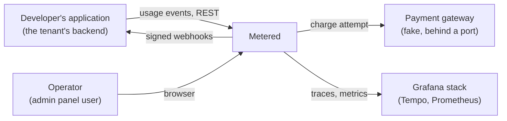
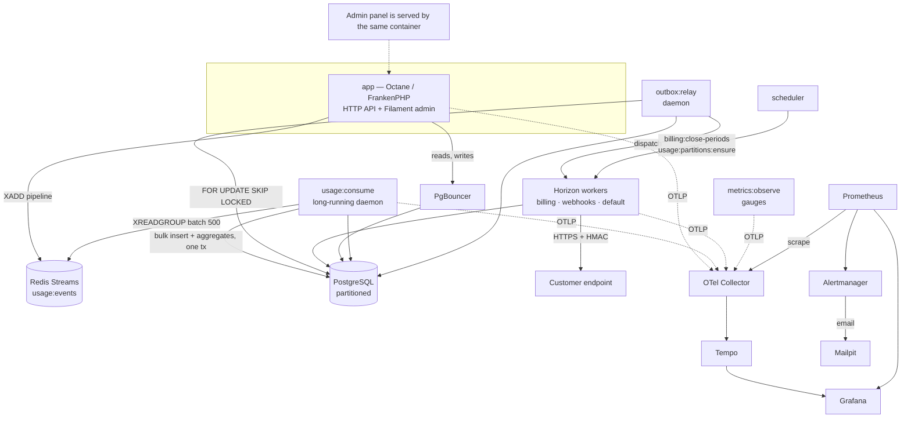

# Architecture

Metered is a **modular monolith**: one deployable, several bounded contexts with
hard boundaries between them. The boundaries are checked by Deptrac on every
pull request, so they are real rather than aspirational.

The choice is deliberate. Usage-based billing is a domain where a single
mispriced line or a double-counted event is a visible bug, and correctness is far
easier to reason about — and to test — when invoice, ledger and outbox writes can
share one ACID transaction. The module boundaries exist so that extracting a
service later is an afternoon of work, not a rewrite. See
[ADR-0001](adr/0001-modular-monolith.md).

## C4 level 1 — context



Metered's customer is a company that sells a metered product. It reports what its
own customers consumed; Metered turns that stream into invoices and tells the
company's systems what happened.

## C4 level 2 — containers



Note which arrows bypass PgBouncer: the daemons hold long-lived connections and
need session-level features that transaction pooling breaks, so they connect to
PostgreSQL directly. Only the stateless web tier is pooled
([ADR-0003](adr/0003-redis-streams-ingestion.md)).

## Modules

| Module | Owns | Published contract |
|---|---|---|
| `Shared` | Clock, Money, UUIDv7, outbox, inbox, idempotency, audit log, tracing, metrics, health checks, problem+json | Used directly by everyone — it is the shared kernel |
| `Tenancy` | Organizations, projects, API keys, scopes, rate limits, admin users | `Tenancy\Application\Contract` |
| `Usage` | Ingestion endpoint, stream consumer, partitions, aggregates, reconciliation | `Usage\Application\Contract` |
| `Billing` | Meters, plans, versions, prices, customers, subscriptions, pricing calculator | `Billing\Application\Contract` |
| `Invoicing` | Period close, invoices, ledger, credit notes, payments, PDF | `Invoicing\Application\Contract` |
| `Webhooks` | Endpoints, signing, delivery, retries, DLQ, circuit breaker, SSRF guard | `Webhooks\Application\Contract` |
| `Admin` | Filament panel shell, navigation, cross-module dashboards | — (presentation only) |
| `Simulation` | Seeding, traffic generation, chaos scenarios, time travel | — (dev only, excluded from the production image) |

`Admin` composes other modules through their contracts; it owns no domain logic.
`Simulation` drives the system through its public HTTP API, so that the code path
it exercises is the same one a real client uses.

## Layers inside a module

```
<Module>/
├── Domain/          Entities, value objects, domain events, repository interfaces,
│                    domain services. No Illuminate\*, no now(), no float money.
├── Application/     Commands, queries, handlers, ports. Depends on Domain only.
│   └── Contract/    The module's public API: interfaces and DTOs other modules may use.
├── Infrastructure/  Eloquent repositories, mappers, Redis clients, HTTP clients.
└── Presentation/    HTTP controllers, form requests, resources, console commands,
                     Filament resources.
```

Dependency direction is inward. `Infrastructure` and `Presentation` know
`Application`; `Application` knows `Domain`; `Domain` knows nothing but a short
allow-list of value libraries (`brick/money`, `brick/math`, `psr/clock`,
`ramsey/uuid`).

## The three flows that matter

### 1. Ingestion

```
POST /api/v1/usage/events
  → authenticate API key (cached)
  → validate shape only (not existence of meter/customer)
  → XADD pipeline to Redis Stream
  → 202 Accepted {accepted, request_id}
```

The hot path never touches PostgreSQL. Heavy validation happens in the consumer,
where a rejected event lands in `usage_event_rejections` with a reason instead of
failing a request the client has already forgotten about. When the stream backs
up beyond a threshold, the API answers `503` with `Retry-After` rather than
silently accumulating lag.

The consumer reads batches of 500, and in **one transaction** does:

```sql
INSERT INTO usage_events (...) VALUES (...)
ON CONFLICT (project_id, event_id, occurred_at) DO NOTHING
RETURNING event_id, customer_id, meter_id, occurred_at, quantity;
-- then upsert usage_aggregates using ONLY the returned rows
```

Delivery from the stream is at-least-once; aggregation is
exactly-once-in-effect, because a redelivered event inserts nothing and therefore
aggregates nothing ([ADR-0004](adr/0004-aggregation-exactly-once-effect.md)).

### 2. Period close and invoicing

The scheduler finds subscriptions whose period ended more than the grace window
ago (default one hour, so that late events still land in the right invoice) and
queues one job per subscription. The job reads the period's usage from the
pre-aggregates through Usage's contract, has Billing price it through the pure
domain calculator, and writes the draft with its lines — plus a late line for
any earlier period that grew since it was billed. A second transaction then
finalizes it: the number from the organization's counter, the ledger
transaction, and the outbox message commit together.

Two concurrent closes of the same subscription produce exactly one invoice
because of `UNIQUE (subscription_id, period_start, period_end)`. The lock is an
optimisation; the constraint is the guarantee.

### 3. Event publication

Nothing dispatches a queue job inside a transaction. State changes write to
`outbox_messages` in the same transaction, and a relay daemon publishes them with
`SELECT ... FOR UPDATE SKIP LOCKED`. Consumers deduplicate through
`inbox_messages`. The `traceparent` header travels in the outbox row, so the
webhook delivery appears in the same trace as the HTTP request that caused it
([ADR-0005](adr/0005-transactional-outbox-inbox.md)).

## Where the admin panel sits

The Filament panel is served by the same Octane container under `/admin`. It is a
presentation concern: resources read their own module's Eloquent models (the
query side), and every write calls an application command handler — the same
handler the REST API calls. There is no second implementation of any business
rule behind the UI. See [`admin-ui.md`](admin-ui.md) and
[ADR-0015](adr/0015-admin-ui-filament.md).

## Failure behaviour, in one table

| Failure | What happens | Where it is verified |
|---|---|---|
| Redis dies briefly | API returns 503 with `Retry-After`; already-queued events survive AOF; consumer resumes from its group offset | `sim:chaos kill-redis-brief` |
| Consumer killed mid-batch | Unacked messages are reclaimed (`XPENDING`, then `XCLAIM`); the insert either committed or did not, so `usage:reconcile` reports zero drift | `sim:chaos kill-consumer` |
| Process dies between commit and dispatch | The outbox row is already committed; the relay publishes it on its next pass | Integration test |
| Customer endpoint down | Retries with backoff and jitter, then the circuit breaker opens; after ten attempts the delivery is dead-lettered and replayable | `sim:chaos failing-webhook` |
| Duplicate event submitted | Redis dedup window catches it; otherwise the partitioned unique index does | Integration test |
