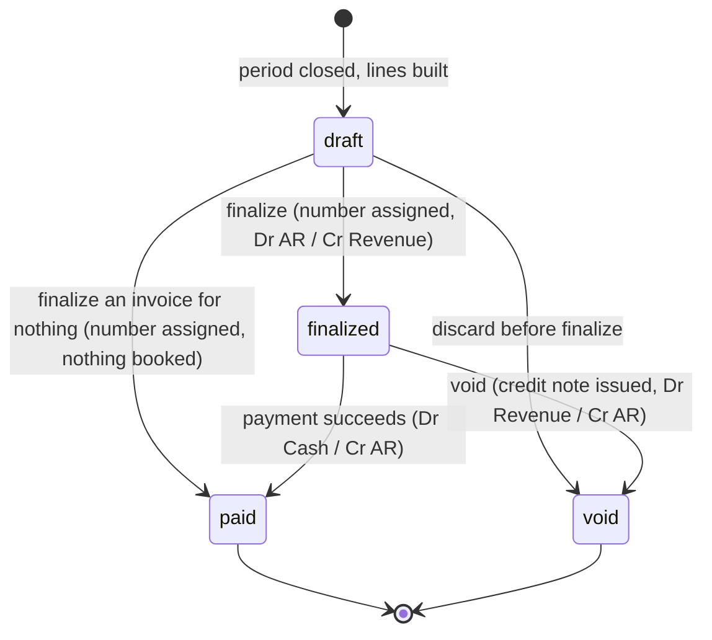
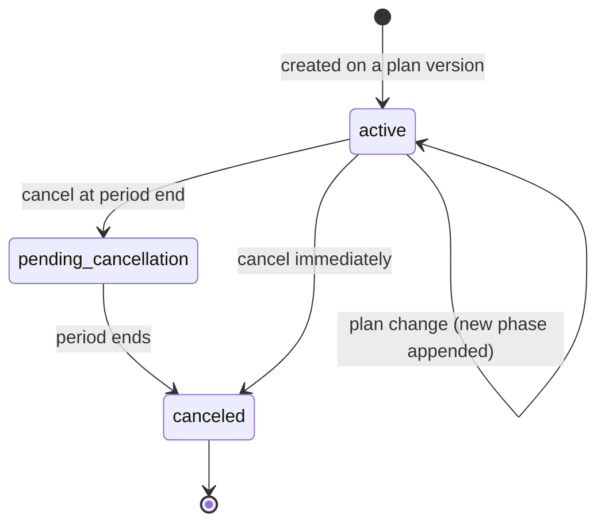
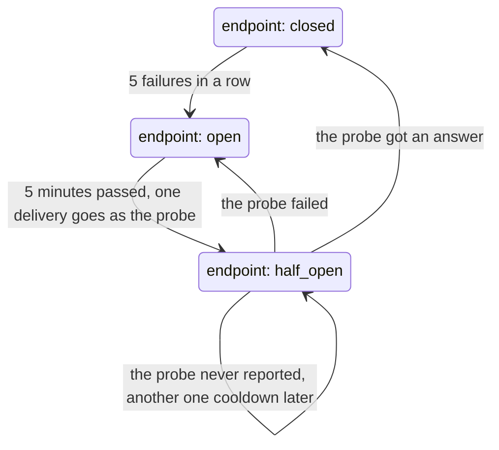
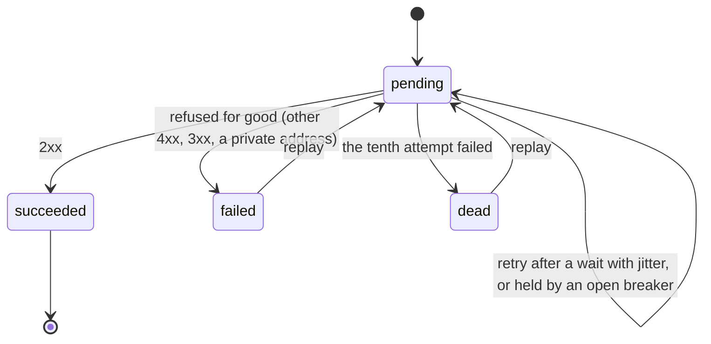

# Domain

The vocabulary below is the one used in code, database columns, API fields and
the admin panel. If a concept is missing here, it does not exist yet — add it in
the same change that introduces it.

## Model

```
Organization ──< Project ──< Customer ──< Subscription ──< SubscriptionPhase
                    │           │                              │
                    ├──< Meter  └──< UsageEvent ──> UsageAggregate
                    ├──< Plan ──< PlanVersion ──< Price
                    ├──< ApiKey
                    └──< WebhookEndpoint ──< WebhookDelivery
```

## Glossary

| Term | Definition |
|---|---|
| **Organization** | A tenant of the platform: the company that bills its own customers. |
| **Demo organization** | An organization created by self-service sign-up in demo mode. Whether it is a demo is fixed when it is created. A demo nobody has signed in to for seven days is **purged**: every row it owns, invoices and ledger included, is deleted — the one way money history is ever removed, and refused by the database for any organization that is not a demo. |
| **Project** | An isolated environment inside an organization, typically `live` and `test`. Keys, meters, plans and customers belong to a project, never to an organization directly. A project declares its **currency** at creation, and everything priced beneath it uses that currency. |
| **API key** | A secret granting access to one project's API, carrying scopes (`usage:write`, `admin`). Format `mk_<env>_<prefix>_<secret>`, e.g. `mk_test_7f3a1b2c_…`; only the eight character prefix and a SHA-256 hash of the whole token are stored. |
| **User** | A person who signs into the admin panel. Separate from an API key: a key authenticates a machine to a project, a user authenticates a person to an organization, and neither is derived from the other. |
| **Membership** | What connects a user to an organization, carrying their role. Authorization asks the membership, never the user. |
| **Role** | One of `owner`, `admin`, `billing_operator`, `viewer`. `admin` (the catalog) and `billing_operator` (the actions that move money) are deliberately not nested. |
| **Panel scope** | The organization and project the panel is currently showing, held in the session and re-derived from the signed-in person's memberships on every read. |
| **Customer** | The end customer of the organization — the party being billed. Identified inside a project by its **reference**, the id the tenant already uses in their own system, which events carry as `customer_ref`. A reference cannot change once registered. |
| **Meter** | The definition of something measurable: a `code` and an **aggregation**. The code is lowercase letters and digits with single `.`, `_` or `-` separators, is matched case-insensitively, and cannot change once defined. |
| **Aggregation** | How a meter's events fold into one number: `sum` adds quantities, `count` counts events whatever their quantity, `max` keeps the highest quantity. All three are commutative, so the order events arrive in never matters. |
| **Usage event** | One fact of consumption: `event_id`, `meter_code`, `customer_ref`, `quantity`, `occurred_at`, free-form `properties`, and the `received_at` it reached the API. Immutable. |
| **Acceptance window** | How far an event's `occurred_at` may sit from its `received_at` and still be counted: seven days back, five minutes ahead. |
| **Rejection** | An accepted event the consumer could not count, stored with its reason (`unknown_meter`, `unknown_customer`, `too_old`, `in_the_future`, `malformed`) and shown in the panel. |
| **Bucket** | The UTC hour an event's `occurred_at` falls in, and the key of its aggregate. |
| **Usage aggregate** | A pre-aggregate of usage per (customer, meter, bucket), with the number of events folded into it. It is what invoicing reads; raw events are only for audit and reconciliation. |
| **Deduplication claim** | A Redis key per (project, `event_id`) holding the `occurred_at` it was first seen with, for seven days. It stops a resend with a corrected timestamp, the one duplicate the database's unique key cannot see. |
| **Backlog** | Events accepted into the stream and not yet written to PostgreSQL. Ingestion answers `503` when it passes the backpressure threshold. Not the stream's length, which includes events already written. |
| **Dead-letter stream** | Where a stream message goes after it could not be read, or after five failed deliveries, so that one bad message cannot stop the consumer. |
| **Drift** | A disagreement `usage:reconcile` finds between an aggregate and the events under it: `missing` (events, no aggregate), `extra` (aggregate, no events) or `mismatch`. |
| **Default partition** | Where events land when their day's partition was not created in time. They are stored and counted, but no longer pruned by time, and are moved out with `usage:partitions:ensure --rescue`. |
| **Plan / PlanVersion** | A tariff and its versions. A version becomes immutable the moment a subscription uses it — otherwise history could be rewritten under a finalized invoice. |
| **Price** | One pricing rule inside a plan version: `flat_fee`, `per_unit`, `graduated`, or `volume`. Usage-based models reference a meter. |
| **Subscription** | A customer's subscription to a plan version, made of **phases** — intervals each pinned to one plan version. A plan change adds a phase rather than mutating history. |
| **Billing period** | A half-open interval `[start, end)` anchored on the subscription's `anchor_at`, clamped at month end (31 Jan → 28 Feb). |
| **Billing cycle** | The sequence of billing periods following from an anchor and an interval (`month` or `year`). Each boundary is the anchor moved on by whole intervals, its time of day kept and its day clamped to the month it lands in — so a cycle anchored on 31 January runs 28 February, then 31 March. All in UTC; daylight saving never moves a boundary. |
| **Grace window** | The delay between a period ending and its invoice being built, so that events arriving late still land in the right invoice. Default one hour. |
| **Late event** | An event whose `occurred_at` falls inside an already finalized period. It appears on the *next* invoice as a separate line flagged `late`. |
| **Late line** | The line that bills late events: the earlier period priced again at what it holds now, minus what was already billed for it. Never negative (assumptions, 25). |
| **Invoice / InvoiceLine** | The document owed by a customer. Numbered gaplessly per organization. Each line carries its **calculation**, the steps that priced it. |
| **Bill to** | Who an invoice is addressed to — the customer's reference and name, copied when the invoice is built, so a later rename does not rewrite it. |
| **Document number** | `INV-000042` or `CN-000007`: a per-organization, per-kind sequence starting at one, advanced inside the transaction that prints it. |
| **Ledger** | An append-only double-entry journal. A balance is always derived from entries, never stored as a mutable number. |
| **Credit note** | A reversal document reducing what is owed; books `Dr Revenue / Cr AR`. In v1 a credit note reverses the whole of a voided invoice, and carries the reason given. |
| **Outbox / Inbox** | Tables guaranteeing that an event is published exactly as often as its state change committed, and processed at most once in effect. |
| **Webhook endpoint** | A customer URL, the events it listens to, a signing secret — two for a day after a rotation — and a circuit breaker (`closed`, `open`, `half_open`). |
| **Webhook delivery** | One event on its way to one endpoint: its body, fixed when it is created, its status and how many attempts it has made. |
| **Attempt** | One try at a delivery, logged with its status code, duration, error and the first kilobyte of the answer. |
| **Audit log** | An append-only, hash-chained record of who did what. Verified by `audit:verify`. |

## Invariants

These are the statements the test suite exists to defend.

**Usage**

0. An accepted event is never lost: it is written, or it is rejected with a recorded reason. A consumer killed at any point, including between the deduplication claim and the commit, loses nothing on redelivery.
1. An event is counted at most once. Redelivery inserts nothing and aggregates nothing.
2. An aggregate always equals the sum (or count, or max) of the raw events it covers — `usage:reconcile` proves it and is run after every chaos scenario.
3. An event outside the acceptance window (older than seven days, or more than five minutes in the future) is rejected with a recorded reason, never silently dropped.

**Billing**

4. A plan version in use is immutable.
5. Periods never overlap and never leave a gap: the end of one is the start of the next.
6. Pricing is a pure function of (plan version, usage, period). Same inputs, same money, forever.
7. Rounding happens exactly once, at the invoice line, `HALF_UP`.
7a. Every price, invoice and ledger entry uses its project's currency. Money of two currencies is never added — the type refuses, and no conversion exists.

**Invoicing**

8. One subscription plus one period yields at most one invoice, enforced by a unique constraint.
9. Invoice numbers are gapless per organization.
10. A finalized invoice is immutable. Corrections happen through credit notes, never edits.

**Ledger**

11. Within one ledger transaction, total debits equal total credits.
12. Entries are never updated or deleted — `UPDATE` and `DELETE` are revoked at the database level, and a test proves it.
13. A balance is an aggregate over entries, never a stored column.

**Delivery**

14. Every state change that emits an event writes its outbox row in the same transaction.
15. A consumer processing the same message twice has the same effect as processing it once.

**Tenancy**

16. Every tenant-owned row carries `organization_id` and `project_id`, and every query filters by them.
17. Revoking an API key takes effect within 30 seconds (the cache TTL), and the delay is documented rather than pretended away.

## State machines

### Invoice



A finalized invoice never goes back to draft. That is what makes gapless
numbering and the ledger trustworthy. The schema holds it too: a trigger lets
an invoice's status only move forward and freezes everything else about it.
Writing an invoice off as uncollectible is not in v1 (assumptions, 28).

### Subscription



A plan change appends a phase that starts at the end of the current period, so
every period is billed on one version. A cancellation at period end drops a
change that would have started then; an immediate cancellation cuts the running
phase short at that instant (assumptions, 23).

### Webhook delivery and circuit breaker



A failure is what says the receiver is down: a timeout, a refused connection,
`5xx`, `408`, `429`. A receiver that answered with a `4xx` is up.



## Pricing models

| Model | Meaning | Boundary case that gets its own test |
|---|---|---|
| `flat_fee` | A fixed amount per period, independent of usage | Partial first period (proration is explicitly out of scope in v1) |
| `per_unit` | `quantity × unit_price` | Fractional quantities; rounding applied once at the line |
| `graduated` | Each tier prices only the units falling inside it | A quantity landing exactly on a tier boundary |
| `volume` | The tier reached prices **all** units | The same boundary quantity, which must produce a different total than `graduated` |

A tier's limit is **inclusive**: exactly 1,000 units lie in the tier that ends
at 1,000. Tier limits rise strictly from zero, only the last tier is unbounded,
and it must be — a table breaking any of those is refused when it is built,
not when an invoice meets it. A graduated charge is summed across its tiers
exactly and rounded once (ADR-0007).

The calculator is a pure domain service: no framework, no clock, no database, no
`float`. It is the single place where money is computed, and it is the module
with the strictest mutation-testing threshold.
