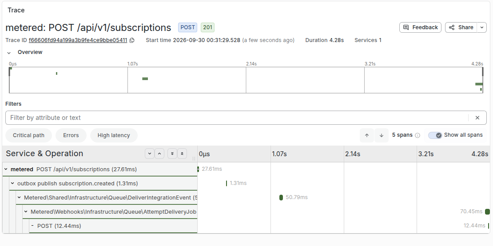
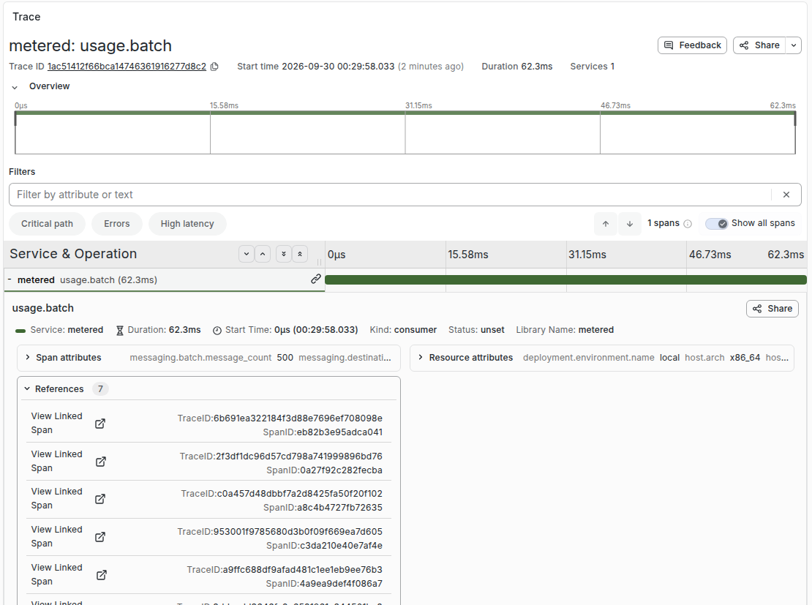
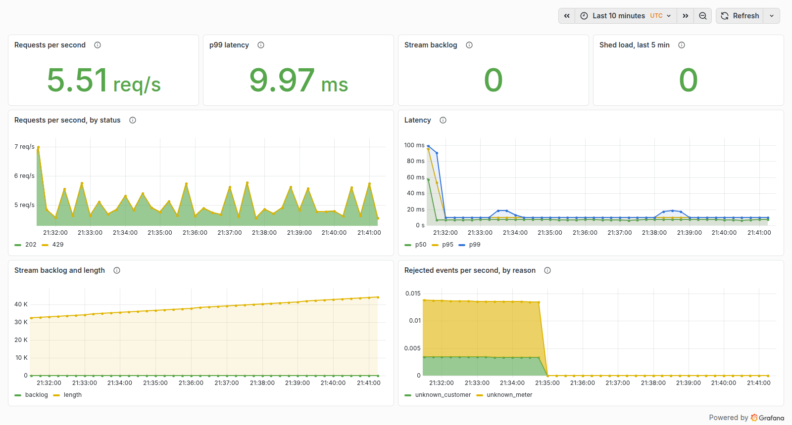
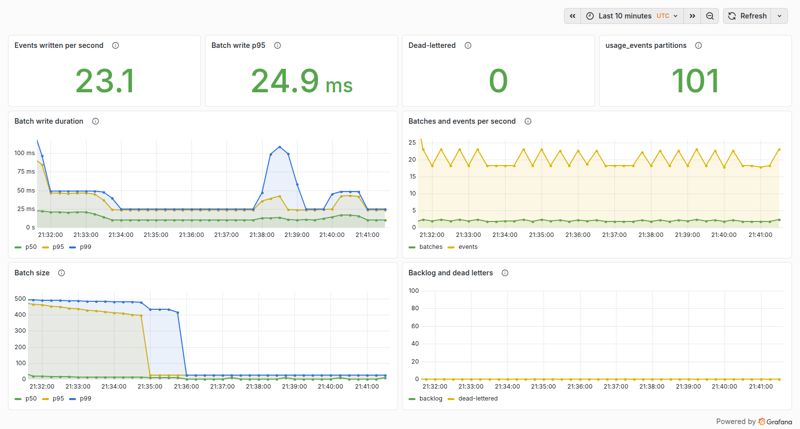
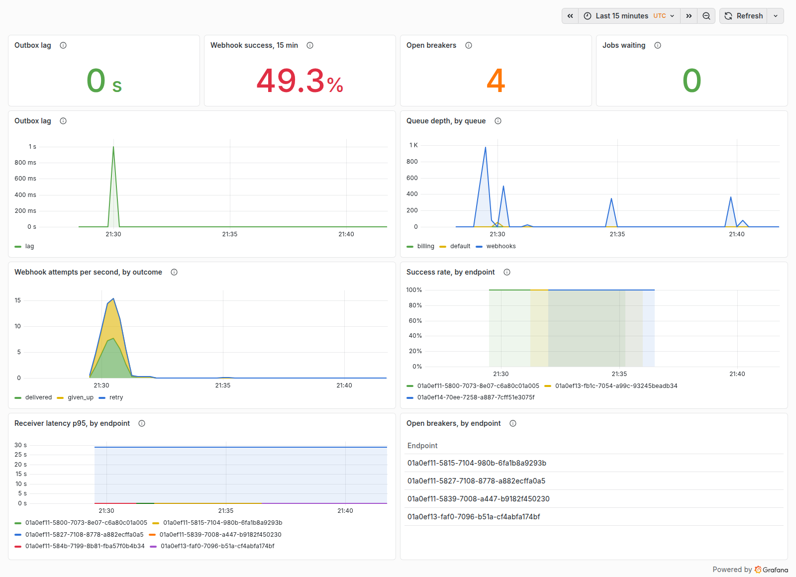
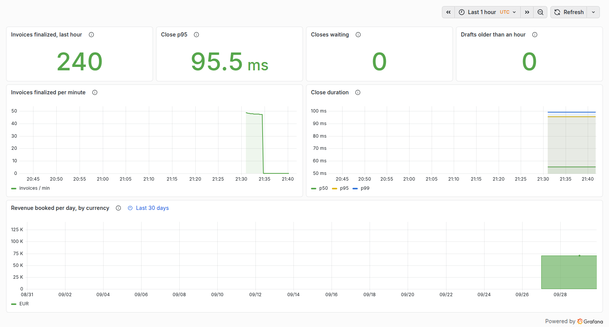
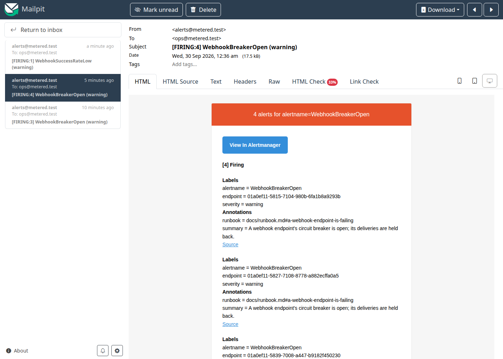

# Observability

Traces, metrics and alerts all run with the stack: `make demo` starts an
OpenTelemetry collector, Tempo, Prometheus and Alertmanager next to the
application, and Grafana reads all three.

| Where | What |
|---|---|
| <http://localhost:3000> | Grafana: the dashboards below; traces under Explore → Tempo |
| <http://localhost:9090> | Prometheus: metrics and the state of each alert rule |
| <http://localhost:9093> | Alertmanager: what is firing now |
| <http://localhost:8025> | Mailpit: the alert emails |

```
processes ──OTLP/HTTP──▶ otel-collector ──▶ Tempo        (traces)
                                      └──▶ /metrics ◀── Prometheus ──▶ Alertmanager ──▶ Mailpit
```

## Traces

Getting a trace to survive the asynchronous hops is most of the work, and it is
the part that is usually skipped (ADR-0012).

| Hop | How context travels |
|---|---|
| HTTP → application | W3C `traceparent` header, or a new root span named after the route |
| Application → Redis Stream | `traceparent` as a field on each stream message |
| Stream → consumer | The `usage.batch` span carries **links** to the requests' traces, not a parent |
| Application → outbox | `traceparent` stored in the message `headers` column |
| Outbox → queue | The relay's `outbox publish` span continues it; the job payload carries it and the worker restores it |
| Queue → webhook delivery | The delivery row keeps it; `webhooks:dispatch` restores it when it queues the attempt |
| Delivery → receiver | The `POST` client span sends `traceparent` to the receiver |
| Period close | Each `billing:close-periods` run is the root of the closes it performs |

Two shapes come out of it, because usage is aggregated rather than forwarded:

- **A state change is one trace** from the request (or the period close)
  through the outbox, the relay, the queue job, the dispatcher and the attempt
  to the receiver's `POST` — the receiver can join it, since the header is
  sent.
- **Ingestion is a request and a batch.** A request's trace ends at `XADD`.
  The consumer's `usage.batch` span, which times the database write, links
  to every request whose events it wrote, up to 128. A batch of 500 events belongs to many
  traces; naming one of them the parent would draw a tree that is false.

Every span is recorded, none sampled away. The SDK's cost is measured in
[`benchmarks.md`](benchmarks.md), run 2: within the noise between runs.

## Metrics

Counters and histograms are recorded by the process doing the work; gauges are
read by one process, `metrics:observe`, every 15 seconds (ADR-0019). Every
metric goes out over OTLP; Prometheus scrapes the collector and nothing else.

| Metric | Why it is the one worth watching |
|---|---|
| `ingest_requests_total`, `ingest_duration_seconds` | The hot path, by status. Latency here is a client-visible promise. |
| `usage_stream_length`, `usage_stream_pending` | Lag. Rising pending means consumers are behind, which is the earliest sign of trouble. |
| `usage_batch_write_duration_seconds`, `usage_batch_size` | Where ingestion capacity is actually spent, and how full the batches are. |
| `usage_events_rejected_total` | By reason. A spike is a client integration breaking. |
| `outbox_unpublished_age_seconds` | The age of the oldest unpublished row — a far better alarm than a count. |
| `queue_depth` | Jobs waiting, by queue. |
| `webhook_deliveries_total`, `webhook_delivery_duration_seconds` | By outcome and endpoint. Success rate per endpoint. |
| `webhook_breaker_open` | Which endpoints are currently cut off. |
| `invoices_finalized_total`, `billing_close_duration_seconds` | Whether period close keeps up. |
| `dlq_size` | Anything in a dead-letter queue is work someone must decide about. |

Ages beat counts for queue alarms: a backlog of 10,000 rows draining in two
seconds is healthy, while three rows stuck for an hour is an incident.

## Logs

Structured JSON on stdout (`LOG_STACK=json`). A line written inside a span
carries its `trace_id` and `span_id`, so an id from `docker compose logs`
pastes into Tempo, and a span in Tempo gives the id to grep for. Never a
secret, an API key, a webhook secret, or a full payload that may contain
personal data. There is no log aggregation service; see the README's
trade-offs.

## Dashboards

Provisioned from the repository under `docker/grafana/`, so a clean clone gets
the same dashboards without clicking. Grafana is open to anonymous viewers and
closed to edits.

1. **Ingestion** — request rate by status, latency percentiles, stream backlog
   and length, shed load, rejections by reason.
2. **Processing** — events written, batch write duration, batch size, dead
   letters, `usage_events` partitions.
3. **Delivery** — outbox lag, queue depth by queue, webhook attempts by
   outcome, success rate and receiver latency by endpoint, open breakers.
4. **Billing** — invoices finalized, close duration, closes waiting, drafts
   older than an hour, revenue booked per day.
5. **Live load** — reads PostgreSQL directly, as `grafana_reader`, a role
   granted `pg_read_all_data` and nothing else: events accepted per minute,
   rejections, outbox age, webhook attempts, invoices. Every figure on it is a
   query a reader can run by hand. The role is created when the database volume
   is first initialised (`docker/postgres/init-metered.sh`).

The billing panels on revenue and old drafts read PostgreSQL too: they are
facts of the invoices, not of a process.

## Alerts

Rules live in `docker/prometheus/rules/metered.yml`, each with a `promtool`
test in `metered.test.yml` (`make alerts-test`, and the CI job `alerts`).
Alertmanager groups by alert name and sends email to Mailpit — an operator's
inbox that never leaves the machine. The list of alerts, and what to do about
each, is in the [runbook](runbook.md#alerts).

## Screenshots

Taken on a stack started from a clean clone with `make demo`, under its
`sim:traffic` (20 events a second). The showcase registers endpoints that fail
on purpose, so the delivery panels show open breakers and a low success rate.

A subscription created through the API, as one trace: the request, the outbox
relay, the fan-out job, and the attempt queued by the next `webhooks:dispatch`
pass with its `POST` to the receiver.



A consumer batch: 500 events from seven requests, and a link to each of them.











`WebhookBreakerOpen` in Mailpit: the showcase's failing endpoints, and the
`/down` endpoint `sim:chaos failing-webhook` registered.


